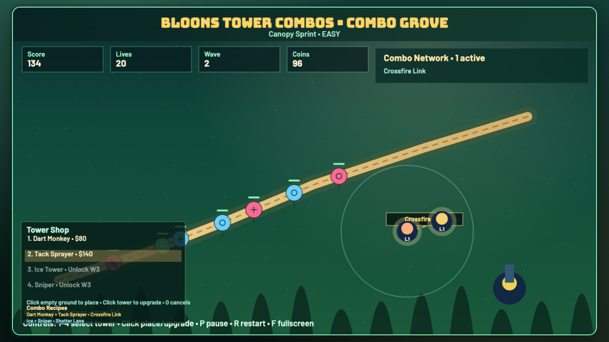

# daily-classic-game-2026-05-05-bloons-tower-combos

<p align="center">
  <strong>Bloons-style lane defense scaffold for today’s tower-combo run.</strong>
</p>

<p align="center">
  
</p>

## GIF Captures
### Start and First Pops
<p align="center">
  
</p>

### Speed Round Burst
<p align="center">
  
</p>

### Pause and Reset
<p align="center">
  
</p>

## Quick Start
```bash
pnpm install
pnpm dev
pnpm test
pnpm build
```

## How To Play
- From title, choose a course and difficulty.
- During gameplay, press `1`-`4` to select a tower, then click ground to place.
- Click an existing tower to upgrade it (up to 2 upgrades).
- If no placement/upgrade action is used, clicking fires a manual assist dart.
- Controls:
- `P`: pause/resume.
- `R`: restart to seeded baseline.
- `F`: toggle fullscreen.
- `0`: cancel tower placement.

## Rules
- Escaped balloons remove one life.
- Balloon tiers have higher health at later waves, and black balloons resist ice slow effects.
- Completing a wave grants bonus coins and unlocks stronger towers by wave.
- Losing all lives ends the run.
- Deterministic scripted mode remains available at `?scripted_demo=1`.

## Scoring
- Popping balloons grants score and coins.
- Score scales up during speed rounds.
- HUD tracks score, lives, wave, and coins.
- `window.render_game_to_text()` exposes deterministic state snapshots.

## Twist
- Speed rounds activate every `20s` for `8s`.
- During speed rounds:
- Balloon movement speed is multiplied by `1.75x`.
- Pop scoring is multiplied by `2x`.
- HUD switches to orange speed-round status with countdown.

## Verification
```bash
pnpm test
pnpm build
WEB_GAME_URL="http://127.0.0.1:4173/?scripted_demo=1" node scripts/capture_playwright.mjs
```

Deterministic capture proof:
- `playwright/main-actions/state-2.json` confirms tower placement and coins update.
- `playwright/main-actions/state-7.json` confirms speed round + progression state.

Browser hooks:
- `window.advanceTime(ms)`
- `window.render_game_to_text()`

## Project Layout
```text
src/
  constants.ts
  types.ts
  rng.ts
  collision.ts
  data/
    maps.ts
    towers.ts
    waves.ts
  systems/
    towers.ts
    waves.ts
  ui/
    menu.ts
  game.ts
  input.ts
  render.ts
  main.ts
scripts/
  self_check.mjs
  capture_playwright.mjs
playwright/
  main-actions/
assets/
  gifs/
docs/plans/
```
