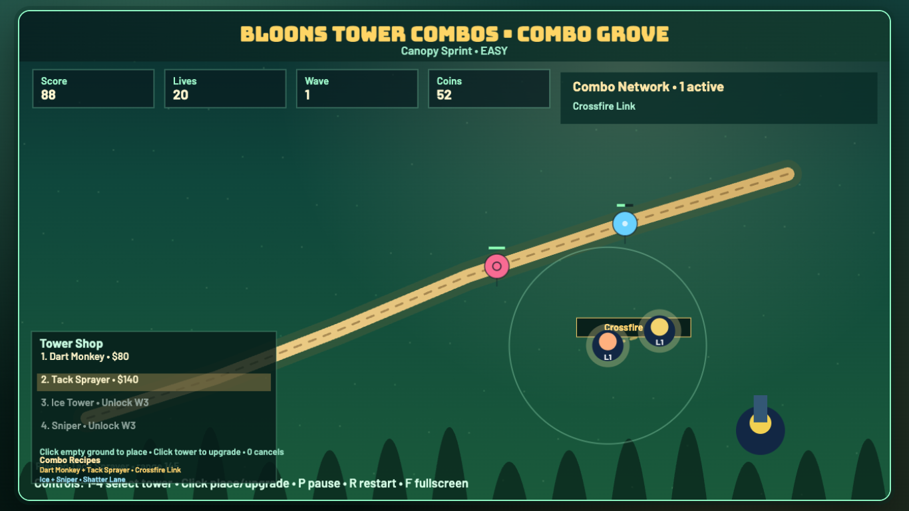

# daily-classic-game-2026-05-05-bloons-tower-combos

<p align="center">
  <strong>Bloons-style lane defense where nearby tower pairs unlock deterministic combo bonuses instead of relying on random spikes.</strong>
</p>

<p align="center">
  
</p>

## GIF Captures
### Combo Link Online
<p align="center">
  
</p>

### Crossfire Pops
<p align="center">
  
</p>

### Pause and Reset
<p align="center">
  
</p>

## Quick Start
```bash
pnpm install
pnpm dev
pnpm test
pnpm build
```

## How To Play
- Choose a course and difficulty, or launch `?scripted_demo=1` for the deterministic automation path.
- Press `1`-`4` to select a tower and click open ground to place it.
- Click an existing tower to buy the next upgrade tier when you have enough coins.
- Click empty ground with no tower selected to fire a manual assist dart from base.
- Controls:
- `P`: pause or resume.
- `R`: restart to the seeded title-state baseline.
- `F`: toggle fullscreen.
- `0` or `Esc`: cancel tower placement.

## Rules
- Bloons follow a seeded path; every escape costs one life.
- Towers cannot overlap the track or another placed tower.
- Waves award completion coins and unlock stronger tower options.
- Combo links only activate when the matching tower pair is within its link radius.
- Losing all lives ends the run immediately.

## Scoring
- Each pop grants base score plus the balloon reward value.
- Combo projectiles add extra score and coin bonuses on successful pops.
- `window.render_game_to_text()` reports deterministic state including `comboCount` and `activeComboIds`.

## Twist
- `Crossfire Link`: place a Dart Monkey and Tack Sprayer close together to speed up their firing cadence and increase pop payouts.
- `Shatter Lane`: place an Ice Tower and Sniper close together so slowed bloons become high-value sniper targets.
- Combo status is surfaced in the HUD and rendered as visible link lines between paired towers.

## Verification
```bash
pnpm test
pnpm build
WEB_GAME_URL="http://127.0.0.1:4173/?scripted_demo=1" node scripts/capture_playwright.mjs
```

Deterministic proof:
- `playwright/main-actions/state-4.json` shows `comboCount: 1` and `activeComboIds: ["crossfire_link"]`.
- `playwright/main-actions/state-6.json` shows combo-tagged pops raising score to `88` and coins to `52`.
- `playwright/main-actions/state-9.json` confirms the combo persists into wave `2` with continued deterministic scoring.

Browser hooks:
- `window.advanceTime(ms)`
- `window.render_game_to_text()`

## Project Layout
```text
src/
  constants.ts
  types.ts
  rng.ts
  collision.ts
  data/
    combos.ts
    maps.ts
    towers.ts
    waves.ts
  systems/
    towers.ts
    waves.ts
  game.ts
  input.ts
  render.ts
  main.ts
scripts/
  self_check.mjs
  capture_playwright.mjs
playwright/
  main-actions/
assets/
  gifs/
docs/plans/
```
